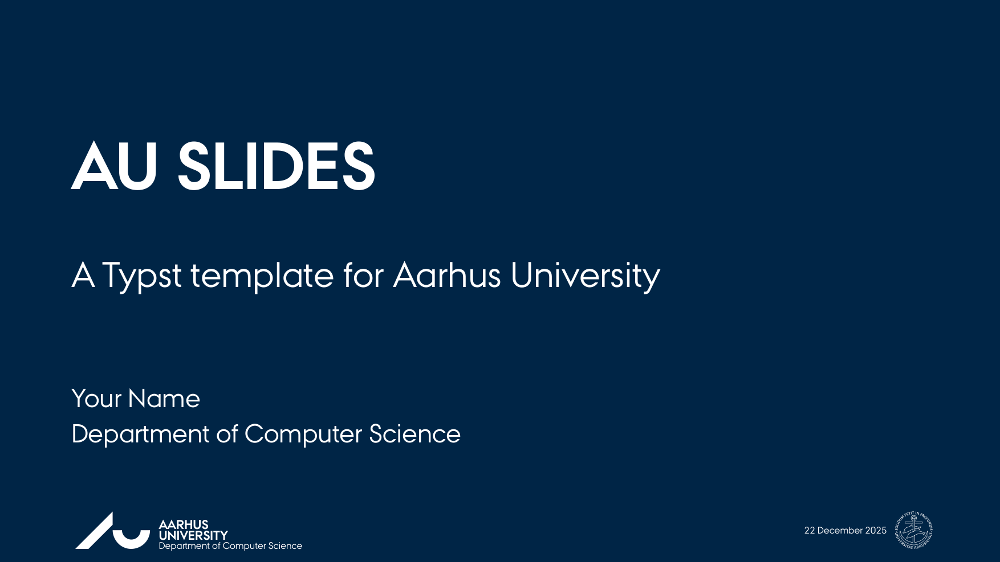
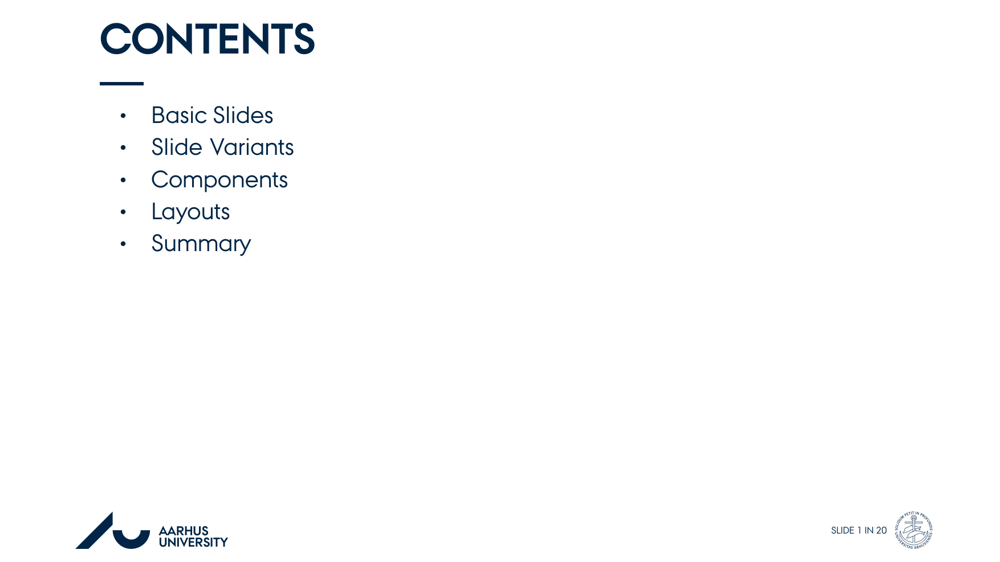
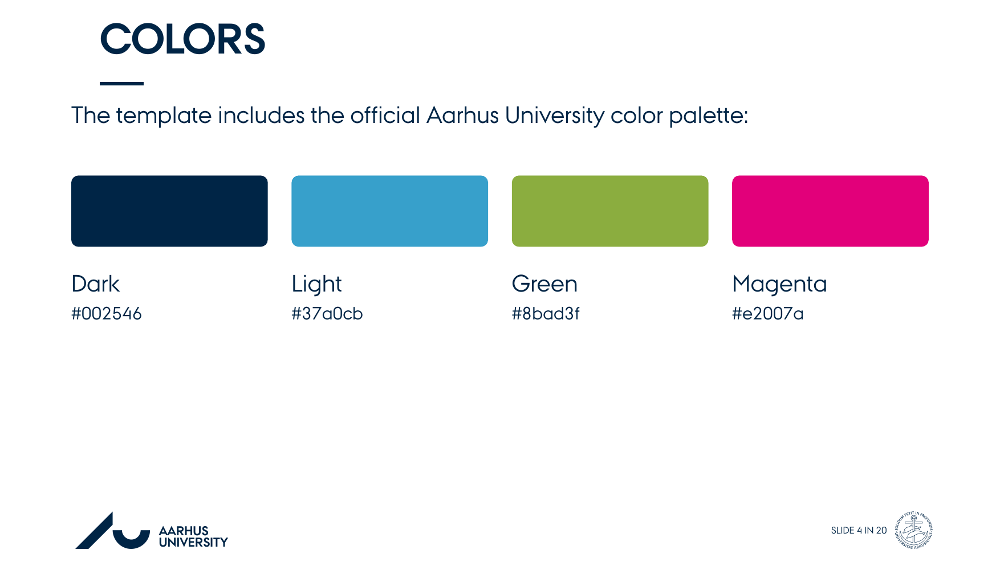
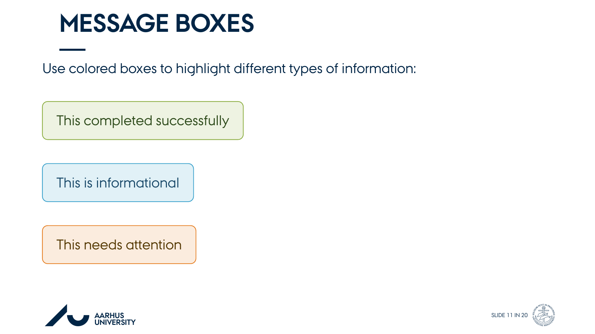
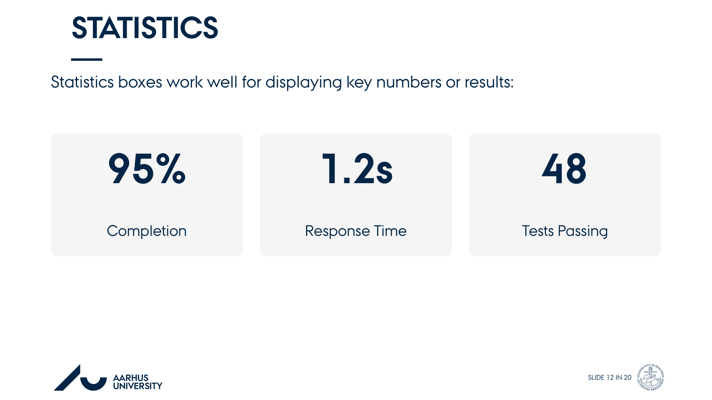
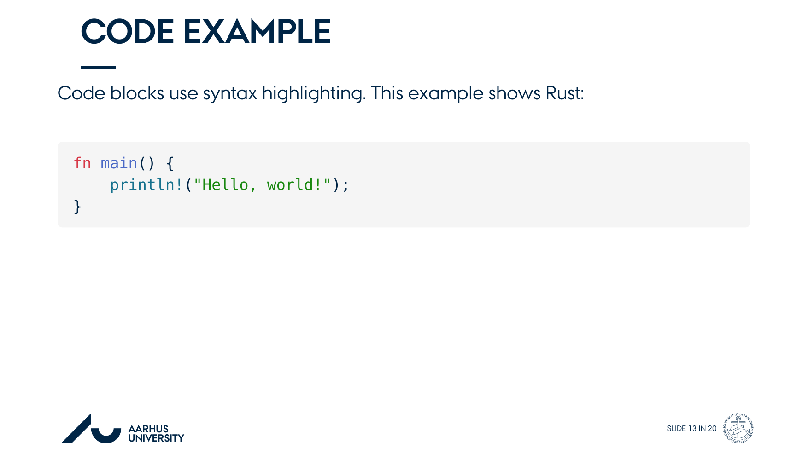

# AU Slides

A presentation template for Aarhus University built with Typst. It provides slide layouts, color schemes, and components that follow the university's visual identity.

<div align="center" float="left">
  
  
  
  
  
  
</div>

## Features

- Aarhus University colors and fonts included
- Multiple slide types: standard, dark background, custom colors, and section dividers
- Content components: message boxes, statistics boxes, callouts, timeline steps
- Layout options for single, two-column, and three-column content
- Plain text source files that work well with version control
- PDF output with proper typography

## Installation

Install to your local Typst packages directory:

```bash
git clone https://github.com/BIRSAx2/au-slides.git
cd au-slides
just install
```

Then import in your presentations:

```typst
#import "@local/au-slides:0.1.0": *
```

## Quick Start

```typst
#import "@local/au-slides:0.1.0": *

#show: au-theme.with(
  aspect-ratio: "16-9",
  text-size: 20pt,
)

#title-slide(
  title: "My Presentation",
  subtitle: "A subtitle",
  author: "Your Name",
  institute: "Department of Computer Science",
)

#slide(title: "Introduction")[
  Your content here.
]
```

## Slide Types

Standard slide with title and content area:

```typst
#slide(title: "Slide Title")[
  Content goes here.
]
```

Dark background slide (useful for emphasis):

```typst
#slide-dark(
  title: "Dark Slide",
  bg-color: au-dark,
  fg-color: au-white,
)[
  White text on dark background.
]
```

Custom background color:

```typst
#slide-color(
  title: "Colored Slide",
  bg-color: au-green,
  fg-color: au-white,
)[
  Content on colored background.
]
```

Section divider:

```typst
#section-slide(
  title: "Section Title",
  subtitle: "Optional subtitle",
)
```

Outline slide that lists all sections:

```typst
#outline-slide(title: "Outline")
```

The outline automatically detects sections from your document.

Bibliography or references slide:

```typst
#bib-slide(
  title: "References",
  bibliography("refs.bib", style: "ieee")
)
```

## Components

Message boxes for different contexts:

```typst
#success[Task completed]
#info[Additional information]
#warning[Caution required]
#error[Something went wrong]
```

Alert and emphasis boxes:

```typst
#alert(title: "Important", body)[Content]
#box(title: "Highlight", body)[Content]
```

Statistics display:

```typst
#stat-box("93%", "Accuracy")
#stat-box("1.2s", "Speed")
```

Callout bubble with optional title:

```typst
#callout(
  title: "Key Point",
  color: au-light,
)[Your message]
```

Timeline for step-by-step processes:

```typst
#timeline-item(1, "Step One", "Description")
#timeline-item(2, "Step Two", "Description")
```

## Layouts

Two-column layout:

```typst
#cols(
  [Left column content],
  [Right column content],
  gutter: 2em,
)
```

Three-column layout:

```typst
#cols3(
  [Column 1],
  [Column 2],
  [Column 3],
  gutter: 1.5em,
)
```

Image with caption:

```typst
#image-with-caption(
  "path/to/image.png",
  caption: "Figure 1: Description",
  width: 70%,
)
```

## Customization

Configure the theme:

```typst
#show: au-theme.with(
  aspect-ratio: "16-9",    // or "4-3"
  text-size: 20pt,
  accent-color: au-light,
)
```

Available colors:

- `au-dark`: #002546 (dark blue)
- `au-light`: #37a0cb (light blue)
- `au-green`: #8bad3f
- `au-magenta`: #e2007a
- `au-red`: #d73f58
- `au-orange`: #e67e22
- `au-white`: #ffffff
- `au-gray`: #f5f5f5

Use these in custom components:

```typst
#slide-color(bg-color: au-green)[Content]
#alert(stroke-color: au-magenta)[Important]
```

Text styling:

- Bold: `*text*` or `#text(weight: "bold")[text]`
- Italic: `_text_` or `#text(style: "italic")[text]`
- Code: `` `code` `` or code blocks with triple backticks

## Fonts

The template uses the official Aarhus University font family:

- AU Passata: main font (regular, light, bold variants)
- AU Logo: university logo glyph
- AU Peto: seal or badge glyph

All fonts are included and automatically loaded.

## Footer and Header

The footer displays the AU logo, university name, and slide number. For title slides, the date appears in the center instead of a slide number. Include department or institute information:

```typst
#slide(
  title: "Title",
  institute: "Department of Computer Science",
)[
  Content
]
```

## Aspect Ratios

Supports both 16:9 (widescreen) and 4:3 (standard):

```typst
#show: au-theme.with(aspect-ratio: "4-3")
```

## Build Commands

```bash
just doc              # Compile template to PDF
just watch            # Watch and rebuild on changes
just install          # Install to @local namespace
just install-preview  # Install to @preview namespace
just uninstall        # Remove from @local
just clean            # Remove build artifacts
just ci               # Build template (for CI/CD)
just thumbnails       # Generate PNG thumbnails of all slides
```

## Requirements

- Typst 0.12.0 or later
- Polylux 0.4.0 (slide management library)

## License

MIT License. See LICENSE file for details.

## Citation

If you use AU Slides in academic work:

```bibtex
@software{au-slides,
  title = {AU Slides: Typst Presentation Template},
  author = {BIRSAx2},
  url = {https://github.com/BIRSAx2/au-slides},
  version = {0.1.0},
  year = {2025}
}
```

## Support

For issues or feature requests, open an issue on GitHub:
https://github.com/BIRSAx2/au-slides/issues
